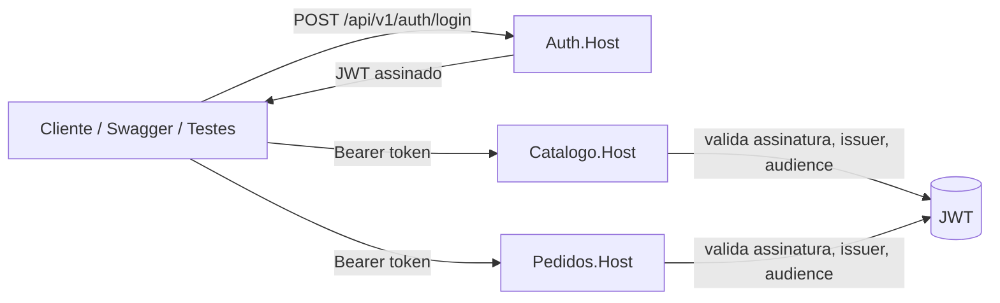

# Visão Geral do Projeto

## Sobre o Projeto

Este é um projeto educacional em **.NET 10 Minimal API** que demonstra três bounded contexts coexistindo no mesmo repositório, cada um seguindo um padrão arquitetural distinto. O objetivo é permitir comparação direta entre abordagens — o mesmo problema (uma API REST com persistência, validação e testes) resolvido com diferentes graus de estrutura e separação de responsabilidades.

## Os Quatro Bounded Contexts

## Autenticacao centralizada (Auth)

A emissao de JWT da solution foi centralizada no microservico `Auth`.

- Emissor de token: `src/Auth/Auth.Host/` + `src/Auth/Auth.Endpoints/`
- Endpoint de login: `POST /api/v1/auth/login` (Auth)
- Resource servers: `Catalogo` e `Pedidos` apenas validam JWT

Diagrama simplificado do fluxo:



### Catálogo

|               |                                                         |
| ------------- | ------------------------------------------------------- |
| **Padrão**    | Clean Architecture híbrida (CA nas camadas, VSA na API) |
| **Diretório** | `src/Catalogo/`                                         |
| **Rotas**     | `/api/v1/catalogo/*`                                    |

Demonstra separação em sub-projetos (Domain, Application, Infrastructure, API), entidades com domínio rico, value objects, repositórios abstraídos por interfaces e rate limiting por política de rota. Contém 5 recursos: Produto, Categoria, Variante, Atributo e Mídia.

Caminhos relevantes:

- `src/Catalogo/Catalogo.Domain/` — entidades e value objects
- `src/Catalogo/Catalogo.Application/` — serviços, DTOs e validadores
- `src/Catalogo/Catalogo.Infrastructure/` — repositórios EF Core e DbSeeder
- `src/Catalogo/Catalogo.Endpoints/Endpoints/` — um arquivo por grupo de recursos

---

### Pedidos

|               |                                            |
| ------------- | ------------------------------------------ |
| **Padrão**    | Vertical Slice Architecture + Domínio Rico |
| **Diretório** | `src/Pedidos/`                             |
| **Rotas**     | `/api/v1/pedidos/*`                        |

Demonstra organização por caso de uso (cada operação é uma pasta isolada), aggregate com regras de negócio encapsuladas, o padrão `Result<T>` em vez de exceções, e auto-descoberta de endpoints via reflection. Autenticação JWT obrigatória.

Caminhos relevantes:

- `src/Pedidos/Pedidos.Endpoints/` — pastas por caso de uso (CreatePedido, GetPedido, etc.)
- `src/Pedidos/Pedidos.Domain/` — aggregate Pedido
- `src/Shared/Web/IEndpoint.cs` — contrato de auto-registro

---

### Pix

|               |                                           |
| ------------- | ----------------------------------------- |
| **Padrão**    | Mock Server + HTTP Client com resiliência |
| **Diretório** | `samples/Pix/`                            |
| **Rotas**     | — (integração externa)                    |

Demonstra como integrar com APIs externas usando mTLS, OAuth2 e pipelines de resiliência (Polly via `Microsoft.Extensions.Http.Resilience`). Inclui um servidor mock que simula a API Pix do BCB e um console app que o consome.

Caminhos relevantes:

- `samples/Pix/Pix.MockServer/` — Minimal API simulando BCB Pix
- `samples/Pix/Pix.ClientDemo/` — console app com HttpClient tipado e resiliência

---

## Caminhos de Aprendizado

### Iniciante

Foco em entender a estrutura básica do projeto e as boas práticas de API REST.

```
README.md
  → docs/01-ARQUITETURA.md
  → docs/02-CATALOGO.md
  → docs/guias/MELHORES-PRATICAS-API.md
```

### Intermediário

Adiciona o estudo de padrões arquiteturais mais sofisticados e domínio rico.

```
(Iniciante, mais:)
  → docs/03-PEDIDOS.md        (Vertical Slice Architecture na prática)
  → Leitura: VSA vs. Layered  (teoria de organização por caso de uso)
  → src/Shared/Common/        (Result pattern, IEndpoint)
```

### Arquiteto

Estudo completo incluindo integração externa, estratégia de testes e decisões arquiteturais registradas.

```
(Intermediário, mais:)
  → docs/04-PIX.md            (mTLS, OAuth2, resiliência)
  → docs/05-TESTES.md         (estratégia e execução)
  → docs/ADRs/                (16 ADRs no formato MADR 3.x)
   → samples/Pix/Pix.ClientDemo/   (resiliência com Polly/Http.Resilience)
```

---

## Mapa da Documentação

| Arquivo                  | Objetivo                                                         | Público                   |
| ------------------------ | ---------------------------------------------------------------- | ------------------------- |
| `README.md`              | Visão geral e início rápido                                      | Todos                     |
| `docs/01-ARQUITETURA.md` | Padrões e fluxo de dados                                         | Intermediário / Arquiteto |
| `docs/02-CATALOGO.md`    | Deep-dive do Catálogo                                            | Intermediário             |
| `docs/03-PEDIDOS.md`     | Vertical Slice e domínio rico                                    | Intermediário / Arquiteto |
| `docs/04-PIX.md`         | Integração externa e resiliência                                 | Intermediário             |
| `docs/05-TESTES.md`      | Estratégia e execução de testes                                  | Todos                     |
| `docs/06-ESTRUTURA.MD`   | Estrutura de projetos, responsabilidades e grafo de dependências | Todos                     |
| `docs/07-EXECUTAR.MD`    | Comandos para executar hosts, samples e testes                   | Todos                     |
| `docs/guias/`            | Guias conceituais de REST e .NET                                 | Iniciante / Intermediário |
| `docs/ADRs/`             | Decisões arquiteturais registradas                               | Arquiteto                 |

---

## Tecnologias

| Tecnologia              | Versão | Papel                         |
| ----------------------- | ------ | ----------------------------- |
| .NET                    | 10 LTS | Runtime e SDK                 |
| EF Core                 | 10     | ORM e migrações               |
| SQLite                  | —      | Banco de dados (dev/testes)   |
| FluentValidation        | 11     | Validação de entrada          |
| Polly / Http.Resilience | v8     | Retry, circuit breaker        |
| JWT Bearer              | —      | Autenticação em Pedidos       |
| xUnit                   | —      | Framework de testes           |
| FluentAssertions        | 6      | Assertivas legíveis em testes |
| AutoMapper              | 13     | Mapeamento DTO ↔ entidade     |
| Serilog                 | 4      | Logging estruturado           |
| Swagger / OpenAPI       | —      | Documentação interativa       |

---

## Roteiros de Aprendizado

### Roteiro 1 — Iniciante (2–3 horas)

Foco: entender a estrutura básica, testar a API e ver as boas práticas.

```
1. Executar a API (5 min)
   dotnet run --project src/Catalogo/Catalogo.Host/Catalogo.Host.csproj

2. Abrir Swagger e explorar endpoints
   http://localhost:5000

3. Ler o guia teórico
   docs/guias/MELHORES-PRATICAS-API.md

4. Explorar a Clean Architecture do Catálogo
   docs/02-CATALOGO.md
   → src/Catalogo/Catalogo.Endpoints/Endpoints/Produtos/ProdutoEndpoints.cs
   → src/Catalogo/Catalogo.Application/Services/ProdutoService.cs
   → src/Catalogo/Catalogo.Domain/Produto.cs

5. Testar via curl (exemplos em docs/02-CATALOGO.md → seção "Exemplos cURL")

6. Rodar os testes
   dotnet test FacShopAPI.slnx
```

### Roteiro 2 — Intermediário (2–3 horas adicionais)

Foco: padrões arquiteturais, domínio rico e Vertical Slice.

```
1. Ler o comparativo arquitetural
   docs/01-ARQUITETURA.md (seção "Comparativo")

2. Estudar Vertical Slice com Pedidos
   docs/03-PEDIDOS.md (completo — tem snippets de código)
   → src/Pedidos/Pedidos.Domain/           (aggregate rico)
   → src/Pedidos/Pedidos.Endpoints/CreatePedido/    (slice completa)
   → src/Shared/Kernel/Result.cs           (Result pattern)
   → src/Shared/Web/IEndpoint.cs           (auto-discovery)

3. Comparar os dois modelos lado a lado
   → Produto.Criar() vs. Pedido.Create()
   → ProdutoService vs. CreatePedidoHandler
   → ProdutoEndpoints vs. CreatePedidoEndpoint

4. Explorar testes
   docs/05-TESTES.md
   → src/Catalogo/Catalogo.Tests/Unit/Domain/ProdutoTests.cs
   → src/Pedidos/Pedidos.Tests/Unit/Domain/PedidoTests.cs

5. Ler o guia de implementação em .NET
   docs/guias/MELHORES-PRATICAS-MINIMAL-API.md
```

### Roteiro 3 — Arquiteto (3–4 horas adicionais)

Foco: decisões arquiteturais registradas, integração externa, resiliência e testes avançados.

```
1. Ler os 16 ADRs (MADR 3.x)
   docs/ADRs/ — decisões registradas com contexto, alternativas e consequências
   Destaques: ADR-0003 (Result pattern), ADR-0009 (IEndpoint), ADR-0013 (rate limiting), ADR-0016 (Auth dedicado)

2. Estudar integração PIX
   docs/04-PIX.md (completo — snippets de HttpClient, OAuth2, idempotência)
   → samples/Pix/Pix.MockServer/Program.cs     (mock server)
   → samples/Pix/Pix.ClientDemo/Program.cs     (pipeline de handlers)

3. Executar e observar a trilha PIX
   Terminal 1: dotnet run --project samples/Pix/Pix.MockServer/Pix.MockServer.csproj
   Terminal 2: dotnet run --project samples/Pix/Pix.ClientDemo/Pix.ClientDemo.csproj
   Testes:     dotnet test samples/Pix/Pix.MockServer.Tests/Pix.MockServer.Tests.csproj

4. Estudar rate limiting avançado
   docs/02-CATALOGO.md → seção "Rate Limiting" e "Exemplos de Código"
   docs/05-TESTES.md → seção "Teste de rate limiting"
   → src/Catalogo/Catalogo.Endpoints/Extensions/RateLimitingExtensions.cs

5. Explorar o ClientDemo de resiliência
   → samples/Catalogo.HttpClientDemo/      (retry + circuit breaker)
   → Polly v8 / Microsoft.Extensions.Http.Resilience

6. Leitura complementar
   docs/guias/JSON-COMPLEXO-E-BOAS-PRATICAS.md
   docs/guias/MELHORIAS-DOTNET-10.md
```

---

## Início Rápido (5 minutos)

```bash
# Pré-requisito: .NET 10 SDK (https://dotnet.microsoft.com/download/dotnet/10.0)

# Restaurar e executar (cada host em um terminal separado)
dotnet run --project src/Auth/Auth.Host/Auth.Host.csproj        # http://localhost:5020
dotnet run --project src/Catalogo/Catalogo.Host/Catalogo.Host.csproj  # http://localhost:5000
dotnet run --project src/Pedidos/Pedidos.Host/Pedidos.Host.csproj     # http://localhost:5001

# Rodar todos os testes (170 testes no total)
dotnet test FacShopAPI.slnx -v minimal
```

Credenciais para obter JWT nos testes e no Swagger: `admin@example.com` / `senha123`.
