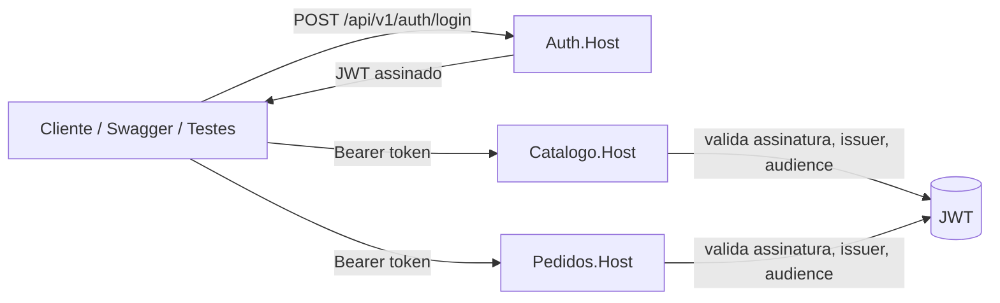

# Visão Geral do Projeto

## Sobre o Projeto

Este é um projeto educacional em **.NET 10 Minimal API** que demonstra três bounded contexts coexistindo no mesmo repositório, cada um seguindo um padrão arquitetural distinto. O objetivo é permitir comparação direta entre abordagens — o mesmo problema (uma API REST com persistência, validação e testes) resolvido com diferentes graus de estrutura e separação de responsabilidades.

## Os Três Bounded Contexts

## Autenticacao centralizada (Auth)

A emissao de JWT da solution foi centralizada no microservico `Auth`.

- Emissor de token: `src/Auth/Auth.Host/` + `src/Auth/Auth.Endpoints/`
- Endpoint de login: `POST /api/v1/auth/login` (Auth)
- Resource servers: `Catalogo` e `Pedidos` apenas validam JWT

Diagrama simplificado do fluxo:



### Catálogo

|                |                                                          |
| -------------- | -------------------------------------------------------- |
| **Padrão**    | Clean Architecture híbrida (CA nas camadas, VSA na API) |
| **Diretório** | `src/Catalogo/`                                          |
| **Rotas**      | `/api/v1/catalogo/*`                                     |

Demonstra separação em sub-projetos (Domain, Application, Infrastructure, API), entidades com domínio rico, value objects, repositórios abstraídos por interfaces e rate limiting por política de rota. Contém 5 recursos: Produto, Categoria, Variante, Atributo e Mídia.

Caminhos relevantes:

- `src/Catalogo/Catalogo.Domain/` — entidades e value objects
- `src/Catalogo/Catalogo.Application/` — serviços, DTOs e validadores
- `src/Catalogo/Catalogo.Infrastructure/` — repositórios EF Core e DbSeeder
- `src/Catalogo/Catalogo.API/Endpoints/` — um arquivo por grupo de recursos

---

### Pedidos

|                |                                             |
| -------------- | ------------------------------------------- |
| **Padrão**    | Vertical Slice Architecture + Domínio Rico |
| **Diretório** | `src/Pedidos/`                              |
| **Rotas**      | `/api/v1/pedidos/*`                         |

Demonstra organização por caso de uso (cada operação é uma pasta isolada), aggregate com regras de negócio encapsuladas, o padrão `Result<T>` em vez de exceções, e auto-descoberta de endpoints via reflection. Autenticação JWT obrigatória.

Caminhos relevantes:

- `src/Pedidos/Features/` — pastas por caso de uso (CreatePedido, GetPedido, etc.)
- `src/Pedidos/Domain/` — aggregate Pedido
- `src/Shared/Common/IEndpoint.cs` — contrato de auto-registro

---

### Pix

|                |                                            |
| -------------- | ------------------------------------------ |
| **Padrão**    | Mock Server + HTTP Client com resiliência |
| **Diretório** | `samples/Pix/`                             |
| **Rotas**      | — (integração externa)                 |

Demonstra como integrar com APIs externas usando mTLS, OAuth2 e pipelines de resiliência (Polly via `Microsoft.Extensions.Http.Resilience`). Inclui um servidor mock que simula a API Pix do BCB e um console app que o consome.

Caminhos relevantes:

- `samples/Pix/Pix.MockServer/` — Minimal API simulando BCB Pix
- `samples/Pix/Pix.ClientDemo/` — console app com HttpClient tipado e resiliência

---

## Caminhos de Aprendizado

### Iniciante

Foco em entender a estrutura básica do projeto e as boas práticas de API REST.

```
README.md
  → docs/01-ARQUITETURA.md
  → docs/02-CATALOGO.md
  → docs/guias/MELHORES-PRATICAS-API.md
```

### Intermediário

Adiciona o estudo de padrões arquiteturais mais sofisticados e domínio rico.

```
(Iniciante, mais:)
  → docs/03-PEDIDOS.md        (Vertical Slice Architecture na prática)
  → Leitura: VSA vs. Layered  (teoria de organização por caso de uso)
  → src/Shared/Common/        (Result pattern, IEndpoint)
```

### Arquiteto

Estudo completo incluindo integração externa, estratégia de testes e decisões arquiteturais registradas.

```
(Intermediário, mais:)
  → docs/04-PIX.md            (mTLS, OAuth2, resiliência)
  → docs/05-TESTES.md         (estratégia e execução)
  → docs/ADRs/                (15 ADRs no formato MADR 3.x)
   → samples/Pix/Pix.ClientDemo/   (resiliência com Polly/Http.Resilience)
```

---

## Mapa da Documentação

| Arquivo                  | Objetivo                            | Público                   |
| ------------------------ | ----------------------------------- | -------------------------- |
| `README.md`              | Visão geral e início rápido      | Todos                      |
| `docs/01-ARQUITETURA.md` | Padrões e fluxo de dados           | Intermediário / Arquiteto |
| `docs/02-CATALOGO.md`    | Deep-dive do Catálogo              | Intermediário             |
| `docs/03-PEDIDOS.md`     | Vertical Slice e domínio rico      | Intermediário / Arquiteto |
| `docs/04-PIX.md`         | Integração externa e resiliência | Intermediário             |
| `docs/05-TESTES.md`      | Estratégia e execução de testes  | Todos                      |
| `docs/guias/`            | Guias conceituais de REST e .NET    | Iniciante / Intermediário |
| `docs/ADRs/`             | Decisões arquiteturais registradas | Arquiteto                  |

---

## Tecnologias

| Tecnologia              | Versão | Papel                          |
| ----------------------- | ------- | ------------------------------ |
| .NET                    | 10 LTS  | Runtime e SDK                  |
| EF Core                 | 10      | ORM e migrações              |
| SQLite                  | —     | Banco de dados (dev/testes)    |
| FluentValidation        | 11      | Validação de entrada         |
| Polly / Http.Resilience | v8      | Retry, circuit breaker         |
| JWT Bearer              | —     | Autenticação em Pedidos      |
| xUnit                   | —     | Framework de testes            |
| FluentAssertions        | 6       | Assertivas legíveis em testes |
| AutoMapper              | 13      | Mapeamento DTO ↔ entidade    |
| Serilog                 | 4       | Logging estruturado            |
| Swagger / OpenAPI       | —     | Documentação interativa      |

---

## Roteiros de Aprendizado

### Roteiro 1 — Iniciante (2–3 horas)

Foco: entender a estrutura básica, testar a API e ver as boas práticas.

```
1. Executar a API (5 min)
   dotnet run --project src/Catalogo/Catalogo.API

2. Abrir Swagger e explorar endpoints
   http://localhost:5001/swagger

3. Ler o guia teórico
   docs/guias/MELHORES-PRATICAS-API.md

4. Explorar a Clean Architecture do Catálogo
   docs/02-CATALOGO.md
   → src/Catalogo/Catalogo.API/Endpoints/Produtos/ProdutoEndpoints.cs
   → src/Catalogo/Catalogo.Application/Services/ProdutoService.cs
   → src/Catalogo/Catalogo.Domain/Produto.cs

5. Testar via curl (exemplos em docs/02-CATALOGO.md → seção "Exemplos cURL")

6. Rodar os testes
   dotnet test tests/FacShopAPI.Tests/
```

### Roteiro 2 — Intermediário (2–3 horas adicionais)

Foco: padrões arquiteturais, domínio rico e Vertical Slice.

```
1. Ler o comparativo arquitetural
   docs/01-ARQUITETURA.md (seção "Comparativo")

2. Estudar Vertical Slice com Pedidos
   docs/03-PEDIDOS.md (completo — tem snippets de código)
   → src/Pedidos/Domain/Pedido.cs          (aggregate rico)
   → src/Pedidos/Features/CreatePedido/    (slice completa)
   → src/Shared/Common/Result.cs           (Result pattern)
   → src/Shared/Common/IEndpoint.cs        (auto-discovery)

3. Comparar os dois modelos lado a lado
   → Produto.Criar() vs. Pedido.Create()
   → ProdutoService vs. CreatePedidoHandler
   → ProdutoEndpoints vs. CreatePedidoEndpoint

4. Explorar testes
   docs/05-TESTES.md
   → tests/FacShopAPI.Tests/Unit/Domain/ProdutoTests.cs
   → tests/FacShopAPI.Tests/Unit/Domain/PedidoTests.cs

5. Ler o guia de implementação em .NET
   docs/guias/MELHORES-PRATICAS-MINIMAL-API.md
```

### Roteiro 3 — Arquiteto (3–4 horas adicionais)

Foco: decisões arquiteturais registradas, integração externa, resiliência e testes avançados.

```
1. Ler os 15 ADRs (MADR 3.x)
   docs/ADRs/ — decisões registradas com contexto, alternativas e consequências
   Destaques: ADR-0003 (Result pattern), ADR-0009 (IEndpoint), ADR-0013 (rate limiting)

2. Estudar integração PIX
   docs/04-PIX.md (completo — snippets de HttpClient, OAuth2, idempotência)
   → samples/Pix/Pix.MockServer/Program.cs     (mock server)
   → samples/Pix/Pix.ClientDemo/Program.cs     (pipeline de handlers)

3. Executar e observar a trilha PIX
   Terminal 1: dotnet run --project samples/Pix/Pix.MockServer/Pix.MockServer.csproj
   Terminal 2: dotnet run --project samples/Pix/Pix.ClientDemo/Pix.ClientDemo.csproj
   Testes:     dotnet test samples/Pix/Pix.MockServer.Tests/

4. Estudar rate limiting avançado
   docs/02-CATALOGO.md → seção "Rate Limiting" e "Exemplos de Código"
   docs/05-TESTES.md → seção "Teste de rate limiting"
   → src/Catalogo/Catalogo.API/Extensions/RateLimitingExtensions.cs

5. Explorar o ClientDemo de resiliência
   → src/Catalogo/Catalogo.ClientDemo/     (retry + circuit breaker)
   → Polly v8 / Microsoft.Extensions.Http.Resilience

6. Leitura complementar
   docs/guias/JSON-COMPLEXO-E-BOAS-PRATICAS.md
   docs/guias/MELHORIAS-DOTNET-10.md
```

---

## Início Rápido (5 minutos)

```bash
# Pré-requisito: .NET 10 SDK (https://dotnet.microsoft.com/download/dotnet/10.0)

# Restaurar e executar
dotnet restore
dotnet run --project src/Catalogo/Catalogo.API

# Swagger UI
open http://localhost:5001/swagger

# Rodar todos os testes (150 testes no total)
dotnet test FacShopAPI.slnx -v minimal
```

Credenciais para obter JWT nos testes e no Swagger: `admin@example.com` / `senha123`.
