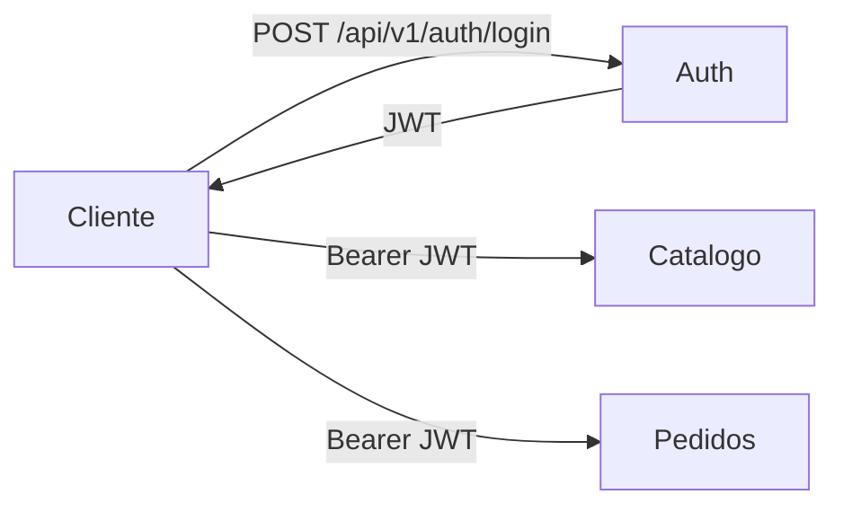

# Servico de autenticacao dedicado (Auth) como emissor oficial de JWT

## Contexto e Declaracao do Problema

A solution possuia endpoint de login no Catalogo para emitir JWT, enquanto Catalogo e Pedidos validavam tokens com JwtBearer. Isso misturava responsabilidade de autenticacao com responsabilidade de dominio no servico de Catalogo.

Precisamos de uma arquitetura mais clara para microservicos:

- um emissor oficial de token;
- servicos de dominio atuando como resource servers;
- documentacao e testes alinhados ao fluxo real.

## Decisao

Adotar microservico dedicado de autenticacao (`Auth`) como emissor oficial de JWT da solution.

### Regras resultantes

- `Auth` expõe `POST /api/v1/auth/login` e emite JWT.
- `Catalogo` e `Pedidos` nao emitem token.
- `Catalogo` e `Pedidos` validam JWT via `AddJwtBearer` (assinatura, issuer, audience, lifetime).
- Configuracoes JWT (`Key`, `Issuer`, `Audience`) devem permanecer alinhadas entre Auth, Catalogo e Pedidos.

## Diagrama simplificado

## Consequencias

### Positivas

- Separacao clara de responsabilidades.
- Menor duplicacao de endpoint de login.
- Melhor base para evolucao futura (refresh token, RBAC, IdP externo).
- Fluxo didatico mais aderente ao mundo real de microservicos.

### Negativas

- Novo ponto de dependencia operacional (Auth) para emissao de tokens.
- Necessidade de sincronizar configuracao JWT entre tres hosts.

### Mitigacoes

- Guardrails em testes para validar token remoto quando `AUTH_BASE_URL` estiver configurado.
- Documentacao explicita indicando emissor e validadores.
- Possibilidade de fallback de testes para token local quando necessario.

## Implementacao resumida

- Criado `src/Auth/Auth.Host/` e `src/Auth/Auth.Endpoints/` com login e health.
- Removido login legado do Catalogo.
- Ajustados testes e documentacao para o fluxo centralizado em Auth.

## Out of Scope

- Refresh token persistido.
- Rotacao de chaves via JWKS/kid.
- Federacao com IdP externo.

---

_Formato baseado no template MADR._
